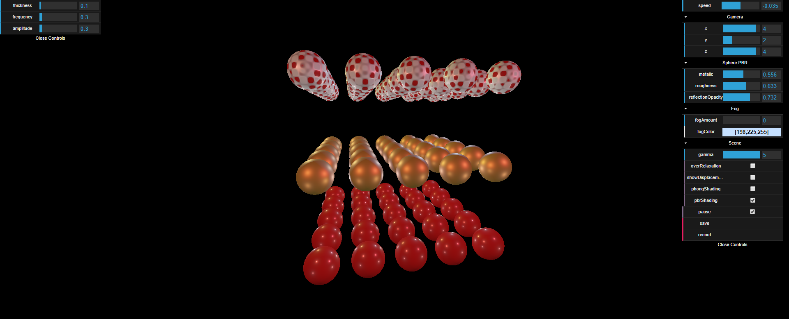

# WGFW

This project is about an angular directive that allow creative coders and shader coders to code theirs 3D scenes using the famous sphere tracing rendering technique. 

The only thing that the coders needs to do is implementing the distance function of the scene that he wants to render, and specify material identifier of each object in order to shade objects in a unique way.

Coders can find in the glsl library lot of utility functions that allow coders to apply some operators to 3D object(union, intersection, substraction, domain repetition, ...).

There is a rish list of materials in a glsl file that can be used when shading te scene. Note that currently, their is two shading techniques that were already implemented namely Phong Shading and Physically Based Rendering Shading(pbr).

GUIs are implemented using dat.gui library.

**Disclaimer : _Only modern browsers that supports webgl2 can run this project !_**

## Useful links:
Those are some resources in which i spent time to implement all 3d computer graphics theories.
* [Sphere Tracing: A Geometric Method for the Antialiased Ray Tracing of Implicit Surfaces by John C. Hart](http://mathinfo.univ-reims.fr/IMG/pdf/hart94sphere.pdf)
* [Enhanced Sphere Tracing by Benjamin Keinert, Henry F Schaefer, Johann Korndörfer, Urs Ganse, Marc Stamminger](https://pdfs.semanticscholar.org/4c9b/d91bd044980f5746d623315be5285cc799c9.pdf)
* [Procedural modeling with signed distance functions by  Carl Lorenz Diener](http://aka-san.halcy.de/thesis.pdf)
* [Modeling with distance functions by Inigo Quilez](http://www.iquilezles.org/www/articles/distfunctions/distfunctions.htm)
* [Free penumbra shadows for raymarching distance fields by Inigo Quilez](http://www.iquilezles.org/www/articles/rmshadows/rmshadows.htm)
* [Smooth minimum by Inigo Quilez](http://www.iquilezles.org/www/articles/smin/smin.htm)

## Screneshots:
those are some screenshots of some running demos:

